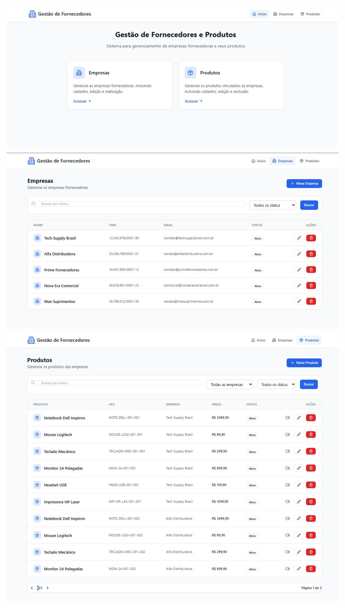

# Supplier Product Management

Desafio técnico full stack para gerenciamento de fornecedores e produtos.

## 📸 Screenshots / Interface do Sistema

Imagem geral da interface do sistema, exibindo a tela inicial, a listagem de empresas e a listagem de produtos.



---

## Stack / Stack utilizada

Backend:
- Laravel 12
- PHP 8+
- Eloquent ORM
- Form Requests
- API Resources

Frontend:
- React
- Vite
- TypeScript
- React Query
- Axios
- Tailwind CSS

---

## Objective / Objetivo

Construir uma aplicação para gerenciamento de empresas fornecedoras e seus produtos.

---

## Features / Funcionalidades

### Empresas
- Listagem de empresas
- Paginação
- Filtro por nome
- Filtro por status
- Cadastro de empresa
- Edição de empresa
- Inativação de empresa
- Bloqueio de exclusão física quando houver produtos vinculados

### Produtos
- Listagem de produtos
- Paginação
- Filtro por nome
- Filtro por status
- Filtro por empresa
- Cadastro de produto
- Edição de produto
- Inativação de produto
- Exclusão física de produto

---

## Business Rules / Regras de negócio

- Uma empresa pode ser marcada como inactive
- Ao inativar uma empresa, seus produtos vinculados também ficam inactive
- Uma empresa com produtos vinculados não pode ser excluída fisicamente
- Produtos podem ser inativados ou removidos fisicamente
- Requisições inválidas retornam erro de validação
- Recursos inexistentes retornam 404

---

## Structure / Estrutura do projeto

supplier-product-management
├── backend
├── frontend
├── README.md
├── LICENSE
└── .gitignore

---

## Architecture / Arquitetura

### Backend (Laravel)

O backend segue o padrão MVC com as seguintes camadas:

```
app/
├── Http/
│   ├── Controllers/Api/    # Controllers para API REST
│   ├── Requests/           # Validação de requisições
│   └── Resources/          # Transformação de dados para JSON
├── Models/                 # Modelos Eloquent
├── Services/               # Lógica de negócio
└── Providers/              # Provedores de serviços
```

**Padrões utilizados:**
- API Resources para transformação de respostas
- Form Requests para validação
- Services para lógica de negócio
- SoftDeletes para exclusão lógica

### Frontend (React)

O frontend segue arquitetura de componentes com React Query para gerenciamento de estado:

```
src/
├── components/
│   ├── layout/             # Componentes de layout
│   └── ui/                 # Componentes de UI reutilizáveis
├── pages/                  # Páginas da aplicação
├── services/               # Serviços de API
├── types/                  # Tipos TypeScript
├── routes/                 # Configuração de rotas
└── lib/                    # Configurações e utilitários
```

**Padrões utilizados:**
- React Query para cache e sincronização de dados
- Axios para requisições HTTP
- Zod + React Hook Form para validação de formulários
- Componentes funcionais com hooks
- TypeScript para tipagem estática

---

## Run / Como executar

### Backend

```
bash
cd backend
composer install
cp .env.example .env
php artisan key:generate
php artisan migrate --seed
php artisan serve --port=8000
```

Backend disponível em: http://127.0.0.1:8000

---

### Frontend

```
bash
cd frontend
npm install
npm run dev
```

Frontend disponível em: http://localhost:5173

---

## Production build

```
bash
cd frontend
npm run build
```

---

## Integration / Integração

O frontend utiliza proxy do Vite para encaminhar chamadas /api para o backend Laravel.

---

## Main Endpoints / Endpoints principais

### Companies
- GET /api/companies - Listar empresas
- POST /api/companies - Criar empresa
- GET /api/companies/{id} - Visualizar empresa
- PUT /api/companies/{id} - Atualizar empresa
- PATCH /api/companies/{id} - Atualizar parcialmente empresa
- DELETE /api/companies/{id} - Excluir empresa

### Products
- GET /api/products - Listar produtos
- POST /api/products - Criar produto
- GET /api/products/{id} - Visualizar produto
- PUT /api/products/{id} - Atualizar produto
- PATCH /api/products/{id} - Atualizar parcialmente produto
- DELETE /api/products/{id} - Excluir produto

---

## Exemplos de Requisições API

### Companies

**Listar empresas com paginação:**
```
bash
curl -X GET "http://127.0.0.1:8000/api/companies?page=1&per_page=10" \
  -H "Accept: application/json"
```

**Filtrar empresas por nome:**
```
bash
curl -X GET "http://127.0.0.1:8000/api/companies?name=Tech" \
  -H "Accept: application/json"
```

**Filtrar empresas por status:**
```
bash
curl -X GET "http://127.0.0.1:8000/api/companies?status=active" \
  -H "Accept: application/json"
```

**Criar empresa:**
```
bash
curl -X POST "http://127.0.0.1:8000/api/companies" \
  -H "Accept: application/json" \
  -H "Content-Type: application/json" \
  -d '{
    "name": "Empresa Teste",
    "cnpj": "12.345.678/0001-90",
    "email": "teste@empresa.com.br",
    "phone": "(11) 99999-9999",
    "address": "Rua Teste, 100",
    "status": "active"
  }'
```

**Atualizar empresa:**
```
bash
curl -X PUT "http://127.0.0.1:8000/api/companies/1" \
  -H "Accept: application/json" \
  -H "Content-Type: application/json" \
  -d '{
    "name": "Empresa Atualizada",
    "cnpj": "12.345.678/0001-90",
    "email": "atualizado@empresa.com.br",
    "phone": "(11) 99999-9999",
    "address": "Rua Atualizada, 200",
    "status": "active"
  }'
```

**Inativar empresa:**
```
bash
curl -X PATCH "http://127.0.0.1:8000/api/companies/1/inactivate" \
  -H "Accept: application/json"
```

**Excluir empresa (se não houver produtos vinculados):**
```
bash
curl -X DELETE "http://127.0.0.1:8000/api/companies/1" \
  -H "Accept: application/json"
```

---

### Products

**Listar produtos com paginação:**
```
bash
curl -X GET "http://127.0.0.1:8000/api/products?page=1&per_page=10" \
  -H "Accept: application/json"
```

**Filtrar produtos por empresa:**
```
bash
curl -X GET "http://127.0.0.1:8000/api/products?company_id=1" \
  -H "Accept: application/json"
```

**Filtrar produtos por nome:**
```
bash
curl -X GET "http://127.0.0.1:8000/api/products?name=Notebook" \
  -H "Accept: application/json"
```

**Filtrar produtos por status:**
```
bash
curl -X GET "http://127.0.0.1:8000/api/products?status=active" \
  -H "Accept: application/json"
```

**Criar produto:**
```
bash
curl -X POST "http://127.0.0.1:8000/api/products" \
  -H "Accept: application/json" \
  -H "Content-Type: application/json" \
  -d '{
    "company_id": 1,
    "name": "Notebook Dell Inspiron",
    "sku": "NOTE-DELL-001-001",
    "price": 3499.90,
    "status": "active"
  }'
```

**Atualizar produto:**
```
bash
curl -X PUT "http://127.0.0.1:8000/api/products/1" \
  -H "Accept: application/json" \
  -H "Content-Type: application/json" \
  -d '{
    "company_id": 1,
    "name": "Notebook Dell Inspiron Plus",
    "sku": "NOTE-DELL-001-001",
    "price": 3999.90,
    "status": "active"
  }'
```

**Inativar produto:**
```
bash
curl -X PATCH "http://127.0.0.1:8000/api/products/1/inactivate" \
  -H "Accept: application/json"
```

**Excluir produto (física):**
```
bash
curl -X DELETE "http://127.0.0.1:8000/api/products/1" \
  -H "Accept: application/json"
```

**Listar produtos de uma empresa específica:**
```
bash
curl -X GET "http://127.0.0.1:8000/api/companies/1/products" \
  -H "Accept: application/json"
```

---

### Respostas de exemplo

**Sucesso - Criar produto (201):**
```
json
{
  "data": {
    "id": 1,
    "company_id": 1,
    "name": "Notebook Dell Inspiron",
    "sku": "NOTE-DELL-001-001",
    "price": "3499.90",
    "status": "active",
    "created_at": "2024-01-01T00:00:00.000000Z",
    "updated_at": "2024-01-01T00:00:00.000000Z",
    "company": {
      "id": 1,
      "name": "Tech Supply Brasil",
      "cnpj": "12.345.678/0001-90",
      "email": "contato@techsupplybrasil.com.br",
      "phone": "(11) 3456-7890",
      "address": "Av. Paulista, 1000 - São Paulo, SP",
      "status": "active"
    }
  }
}
```

**Erro de validação (422):**
```
json
{
  "message": "The given data was invalid.",
  "errors": {
    "name": ["Nome é obrigatório"],
    "sku": ["SKU é obrigatório"]
  }
}
```

**Recurso não encontrado (404):**
```
json
{
  "message": "Produto não encontrado."
}
```

---

## Technologies / Tecnologias utilizadas

Backend:
- Laravel
- PHP
- Eloquent ORM
- Migrations
- Seeders

Frontend:
- React
- TypeScript
- Vite
- React Query
- Axios
- Tailwind

---

## Notes / Observações

Os dados cadastrados são apenas para demonstração do desafio técnico.

---

Autor: Kaike Souza
